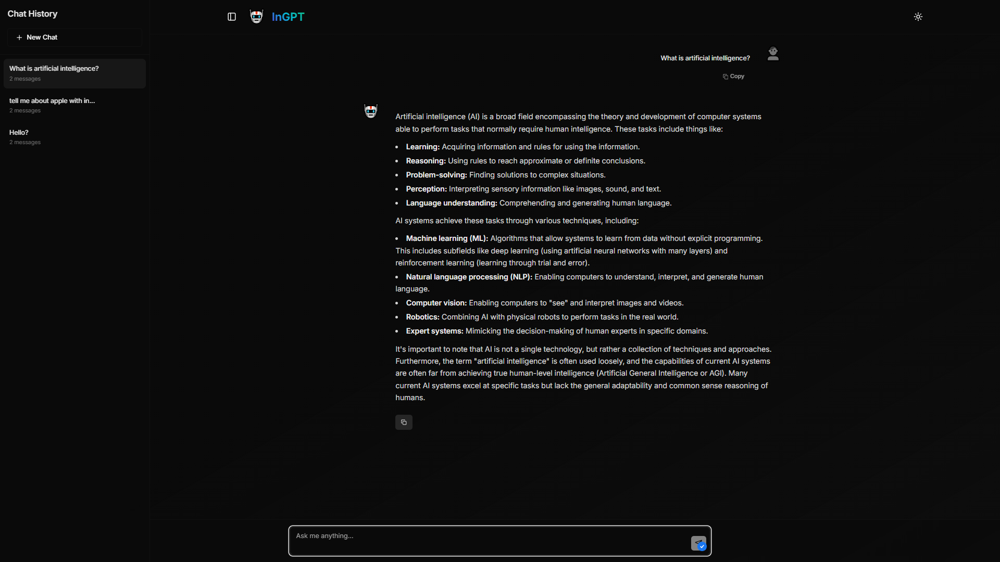

# 🤖 InGPT

<div align="center">

  

  
  
  
  
  
</div>

<div align="center">
  <h3>🧠 A Modern, Beautiful AI Assistant with Advanced Capabilities</h3>
  <p>Built with Next.js, TypeScript, and powered by Google's Gemini API</p>
</div>

<div align="center">
  
  
  
  
</div>

---

## ✨ Features

<div align="center">
  <table>
    <tr>
      <td align="center">🤖<br><b>AI-Powered</b><br>Google Gemini API</td>
      <td align="center">🌙<br><b>Theme Support</b><br>Dark/Light Mode</td>
      <td align="center">📱<br><b>Responsive</b><br>Mobile-First Design</td>
      <td align="center">⚡<br><b>Fast</b><br>Optimized Performance</td>
    </tr>
    <tr>
      <td align="center">✨<br><b>Animations</b><br>Smooth Transitions</td>
      <td align="center">💬<br><b>Chat History</b><br>Message Management</td>
      <td align="center">📋<br><b>Copy Support</b><br>One-Click Copy</td>
      <td align="center">🎯<br><b>Auto-Focus</b><br>Enhanced UX</td>
    </tr>
  </table>
</div>

## 🚀 Quick Start

### Prerequisites

- Node.js 18+
- npm or yarn
- Google AI Studio API Key

### Installation

1. **Clone the repository**
   ```bash
   git clone https://github.com/niladri-1/InGPT_Chatbot.git
   cd InGPT_Chatbot
   ```

2. **Install dependencies**
   ```bash
   npm install
   # or
   yarn install
   ```

3. **Set up environment variables**
   ```bash
   cp .env.example .env.local
   ```

   Add your Gemini API key to `.env.local`:
   ```env
   NEXT_PUBLIC_GEMINI_API_KEY=your_actual_api_key_here
   ```

4. **Run the development server**
   ```bash
   npm run dev
   # or
   yarn dev
   ```

5. **Open your browser**
   Navigate to [http://localhost:3000](http://localhost:3000)

## 🔧 Scripts

| Command | Description |
|---------|-------------|
| `npm run dev` | Start development server |
| `npm run build` | Build for production |
| `npm run start` | Start production server |
| `npm run lint` | Run ESLint |

## 🛠️ Tech Stack

<div align="center">
  <table>
    <tr>
      <td align="center"><b>Frontend</b></td>
      <td align="center"><b>Styling</b></td>
      <td align="center"><b>Animation</b></td>
      <td align="center"><b>AI</b></td>
    </tr>
    <tr>
      <td align="center">
        • Next.js 13+<br>
        • TypeScript<br>
        • React 18
      </td>
      <td align="center">
        • Tailwind CSS<br>
        • shadcn/ui<br>
        • CSS Variables
      </td>
      <td align="center">
        • Framer Motion<br>
        • CSS Transitions<br>
        • Smooth Scrolling
      </td>
      <td align="center">
        • Google Gemini<br>
        • Generative AI SDK<br>
        • React Markdown
      </td>
    </tr>
  </table>
</div>

## 🎨 UI Components

- **Modern Design**: Clean, minimalistic interface
- **Responsive Layout**: Works on all devices
- **Theme Support**: Dark/Light mode with system preference
- **Smooth Animations**: Framer Motion powered transitions
- **Accessibility**: ARIA labels and keyboard navigation

## 🔐 Environment Variables

Create a `.env.local` file in the root directory:

```env
# Google AI Configuration
NEXT_PUBLIC_GEMINI_API_KEY=your_actual_api_key_here
```

> **Note**: Get your API key from [Google AI Studio](https://makersuite.google.com/app/apikey)

## 📁 Project Structure

```
ingpt/
├── components/          # Reusable UI components
│   ├── ui/             # shadcn/ui components
│   ├── message-bubble.tsx
│   ├── sidebar.tsx
│   └── ...
├── app/                # Next.js App Router
│   ├── globals.css
│   ├── layout.tsx
│   └── page.tsx
├── lib/                # Utility functions
├── public/             # Static assets
└── ...
```

## 🤝 Contributing

We welcome contributions! Please follow these steps:

1. Fork the repository
2. Create a feature branch (`git checkout -b feature/amazing-feature`)
3. Commit your changes (`git commit -m 'Add amazing feature'`)
4. Push to the branch (`git push origin feature/amazing-feature`)
5. Open a Pull Request

## 📝 License

This project is licensed under the MIT License - see the [LICENSE](LICENSE) file for details.

## 🙏 Acknowledgments

- [Google AI](https://ai.google.dev/) for the Gemini API
- [Vercel](https://vercel.com/) for Next.js
- [shadcn/ui](https://ui.shadcn.com/) for beautiful components
- [Tailwind CSS](https://tailwindcss.com/) for utility-first styling
- [Framer Motion](https://www.framer.com/motion/) for animations

---

<div align="center">
  <p>Made with ❤️ by <a href="https://github.com/niladri-1">Niladri Chatterjee</a></p>
  <p>
    <a href="https://github.com/niladri-1/InGPT_Chatbot">⭐ Star this repo</a> •
    <a href="https://github.com/niladri-1/InGPT_Chatbot/issues">🐛 Report Bug</a> •
    <a href="https://github.com/niladri-1/InGPT_Chatbot/issues">💡 Request Feature</a>
  </p>
</div>